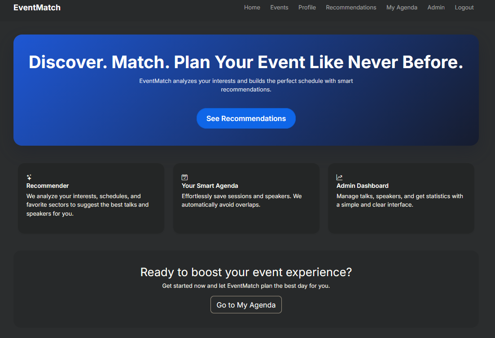

# EventMatch
#### Video Demo:  <https://www.youtube.com/watch?v=IBqSJkNYI04>

EventMatch is a web application designed to enhance the experience of event attendees by intelligently matching them with talks, exhibitors, and activities based on their interests.  
Developed as my **Final Project for Harvard’s CS50x**, this platform brings together event management, personalized recommendations, and user interaction in one place.

---

## 🚀 Features

### 🔍 Personalized Recommendations
- Matches attendees with the most relevant **talks, exhibitors, and activities**.
- Uses user preferences and event data to provide smart suggestions.

### 🗓️ Interactive Agenda
- Users can save talks and activities to their **personal schedule**.
- Automatic conflict detection between overlapping sessions.

### 🧭 Exhibitor Explorer
- Browse exhibitors by **category, industry, or interest**.
- View exhibitor details, descriptions, and booth location.

### 🎤 Admin Panel
- Administrators can:
  - Add, edit, or delete **talks, exhibitors, and speakers**.
  - View attendee activity.
  - Manage event information.

### 💾 SQLite Database
- Lightweight and efficient storage for:
  - Users  
  - Talks  
  - Exhibitors  
  - Schedules  
  - Preferences  

---

## 🛠️ Technologies Used

- **Python** (Flask)
- **HTML5 / CSS3**
- **Bootstrap**
- **SQLite3**
- **Jinja Templates**

---

## 📂 Project Structure
	/project
	│── static/
	│ ├── styles.css
	│ ├── scripts.js
	│
	│── templates/
	│ ├── index.html
	│ ├── login.html
	│ ├── register.html
	│ ├── agenda.html
	│ ├── exhibitors.html
	│ ├── admin/
	│ ├── dashboard.html
	│ ├── add_talk.html
	│ ├── add_exhibitor.html
	│
	│── app.py
	│── eventmatch.db
	│── requirements.txt
	│── README.md

---

🤝 Acknowledgments

Special thanks to Harvard CS50, its staff, and its community for the guidance and inspiration throughout the course.

